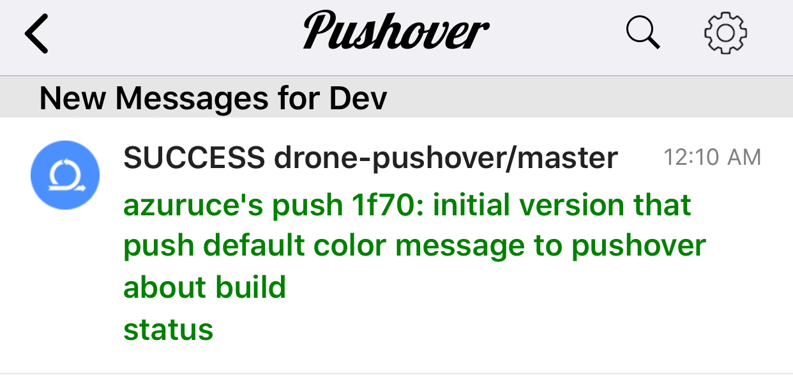

# drone-pushover

[](https://discourse.drone.io)
[](https://stackoverflow.com/questions/tagged/drone.io)

Drone plugin for sending Pushover notifications.

## Usage

Sign up for a free pushover account at www.pushover.net and create pushover_user and pushover_token.
Add the below notify pipeline stage in the .drone.yaml to your own project. Add pushover_user and pushover_token as secrets. Your project will now automatically notify you on your pushover client when build is complete. The message will be colored green/red in your app with your build information and a direct link to your drone build

```
  notify:
    image: azuruce/drone-pushover
    secrets: [pushover_user, pushover_token]
```

Or more advanced usage

```
  notify:
    image: azuruce/drone-pushover
    html: 1
    user: <pushover_user>
    token: <pushover_token>
    title: customized title
    url: customized url
    url_title: customized url title
    message: customized message
    sound: <pushover_sound>
    secrets: [pushover_user, pushover_token]
```

## Screen shot


## Docker

If you are interested in building the image yourself, use the following command line.

```
DOCKER_USERNAME=xxx DOCKER_PASSWORD=yyy drone exec
```

